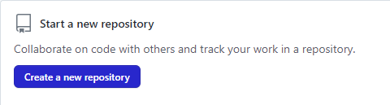
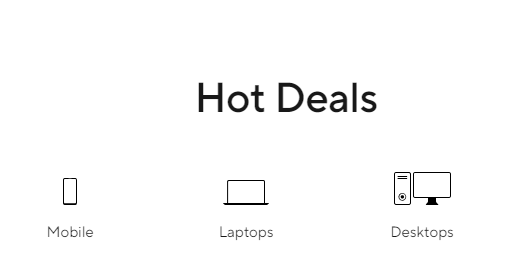
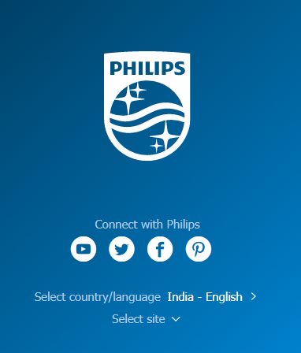

# Dom Manipulation Assignment

## 1. Webiste Name: [Dev To](https://dev.to/) ✅

### Topics

    - Query Selctory, Inner HTML

### Sample Image


### Tasks

        Target the Top description div and change the DEV Community to <Your_Name> and description to your passion

### Output


## Solution

```js
// to change top description
document.querySelector('.crayons-subtitle-2').innerHTML = 'Vimal Kumar';

// to change description
document.querySelector('aside p').innerHTML = 'I love ❣️ to write code!';
```

---

## 2. Website Name: [Apple](https://support.apple.com/en-in)

### Task


### Fetch all the product name and store in an array

### Output

['iPhone', 'Mac', 'iPad', 'Watch', 'AirPods', 'Music', 'TV']

## Solution

```js
// making array to store product list
let appleProductNames = [];
// looping through product cards
for (item of document.querySelectorAll(
  '.as-imagegrid-item .as-imagegrid-item-title'
)) {
  // finding relavant details and pushing it to our array
  appleProductNames.push(item.firstChild.data);
}
console.log(appleProductNames);
```

---

##

3. Webiste Name: [Youtube Support](https://support.google.com/youtube/)

### Topics

    - Get Element By Id, Create Element, Create Text Node, Append Child

### Sample Image


### Tasks

     Add another FAQ 'My New FAQ' to the list

### Output


## Solution

```js
// finding container
let helpTopics = document.getElementsByClassName('accordion-homepage')[0];
// creating new section element
let newTopic = document.createElement('section');
// adding h3 in section
newTopic.innerHTML = "<h3 role='button'>My new FAQ</h3>";
// giving class to the section
newTopic.classList.add('parent');
// adding newly created element to the container
helpTopics.appendChild(newTopic);
```

---

## 4. Webiste Name: [OnePlus](https://www.oneplus.in/support)

### Topics

     Query Selector, InnerText

### Sample Image


### Tasks

      Change the contact number

### Output


## Solution

```js
// Changing text
document.querySelector('.one-tel-number.service-number').innerText =
  '+91 8818029983';

// changing attribute
document.querySelector('.one-tel-number.service-number')['href'] =
  'tel:+91 8818029983';
```

---

## 5. Webiste Name: [Samsung](https://www.samsung.com/in/offer/online/samsung-fest/)

### Topics

       getElementById, createElement, InnerText, append, setAttribute

### Sample Image


### Tasks

     Target the main div of card and change the Button text to Check out

### Output


## Solution

```js
// getting early access product cards
let earlyAccessProducts = document.querySelectorAll(
  '.feature-column-carousel__inner'
)[0];

// getting buy buttons
let buybutton = earlyAccessProducts.querySelectorAll(
  '.cta.cta--contained.cta--black'
);

// looping through buttons and changing text to "check our"
for (button of buybutton) {
  button.innerText = 'Check out';
}
```

---

## 6. Webiste Name: [Adidas](https://www.adidas.co.in/)

### Topics

    -   Query Selector, Event listeners, Changing Styles

### Sample Image


### Tasks

     Target the search box and on hover change thebackground color to red.

### Output


## Solution

```js
// finding search box
let search = document.querySelector('input.searchinput___zXLAR');

// adding event listener and changing color
search.addEventListener(
  'mouseenter',
  () => (search.style.backgroundColor = 'Red')
);
```

---

## 7. Webiste Name: [MDN Web Docs](https://developer.mozilla.org/en-US/)

### Topics

       Form, Value, Submit

### Sample Image


### Tasks

     To Search a topic in the MDN Search bar.
     First add a text to search in the search bar and then hit the submit search button to search the docs using DOM

### Output


## Solution

```js
// adding value to input box
document.getElementById('hp-search-input').value = 'CSS Selector';

// submit form
document.getElementById('hp-search-form').submit();
```

---

## 8. Webiste Name: [Google](https://www.google.com/)

### Topics

       Remove Elements

### Sample Image


### Tasks

     Remove alternate languages from the home page languages listed

### Output


## Solution

```js
// Get parent
let languageBar = document.getElementById('SIvCob');

// get languages
let languages = document.querySelectorAll('#SIvCob a');

// go through every element and remove every other
for (let i = 0; i < languages.length; i++) {
  if (i % 2 === 0) {
    languageBar.removeChild(languages[i]);
  }
}
```

---

## 9. Webiste Name: [Code Wars](https://www.codewars.com/)

### Topics

       Change Font Family, Color of Text.

### Sample Image


### Tasks

    Change the font family of the text to monospace and text color to the logo’s background color.

### Output


## Solution

```js
// change  font family
document.getElementsByClassName('display-heading-1')[0].style.fontFamily =
  'Monospace';

// change color
document.getElementsByClassName('display-heading-1')[0].style.color = '#b1361e';
```

---

## 10. Webiste Name: [Freecodecamp](https://www.freecodecamp.org/)

### Topics

       querySelector, mouseover, click eventListener,  callback function, style,

### Sample Image


### Tasks

    Target the button and change background colour on mouseover

### Output


## Solution

```js
// targeting login button text
let mainLoginText = document.getElementsByClassName('login-btn-text')[1];

// adding event listener and changing color
mainLoginText.addEventListener(
  'mouseover',
  () => (mainLoginText.style.backgroundColor = 'Red')
);
```

---

## 11. Webiste Name: [realme](https://www.realme.com/in/)

### Topics

       querySelector,style,background-image

### Sample Image


### Tasks

    change the realme logo to ineuron logo

### Output


## Solution

```js
// targeting logo
let logo = document.querySelector('span.icon.icon-logo.in');

// changing logo
logo.style.backgroundImage =
  "url('https://ineuron.ai/images/ineuron-logo.png')";

// adjusting logo
logo.style.backgroundSize = 'contain';
```

---

## 12. Webiste Name: [Github](https://github.com/)

### Topics

       querySelector,style,background-Color

### Sample Image


### Tasks

     change the background colour of the button to blue.

### Output



## Solution

```js
// selecting button and changing its color to blue
document.querySelector('button.btn-primary.btn').style.backgroundColor = 'blue';
```

---

## 13. Webiste Name: [Hackerrank](https://www.hackerrank.com/)

### Topics

       querySelector,innerHtml

### Sample Image


### Tasks

Target the top description and change “Matching developers with great companies” to ‘JSBOOTCAMP“.

### Output


## Solution

```js
// selecting and changing text
document.querySelector('.fl-heading-text').innerHTML = 'JSBOOTCAMP';
```

---

## 14. Webiste Name: [Asus](https://www.asus.com/in/)

### Topics

      querySelector,style,font-size

### Sample Image



### Tasks

       change the fontsize of “Hot Deals” to 80px

### Output


## Solution

```js
// targeting title and changing font size to 80px
document.querySelector('.HotDealsAll__Heading__2fIbe').style.fontSize = '80px';
```

---

## 15. Webiste Name: [Dell](https://www.dell.com/en-in/shop/deals/laptop-deals?gacd=10415953-9016-5761040-285981356-0&dgc=ST&gclid=Cj0KCQjwguGYBhDRARIsAHgRm4-XUDMhhVNyHXb3s1gY4ZBzORr_d9Se-buhJwy7asyUe7YdqEA11eEaAt6UEALw_wcB&gclsrc=aw.ds&nclid=BxjBlpBQsX6pjSHh-L8YYSU77EpfXRkG1AGMB5Wbeu386ykspfrPDnfx_DdFau20)

### Topics

      querySelector,style.textAlign

### Sample Image


### Tasks

       Convert the text “G15 Gaming Laptop” from left to right

### Output


## Solution

```js
// shifting name to right using flex-end
document.querySelector('.hero-content .d-flex').style.justifyContent =
  'flex-end';
```

---

## 16. Webiste Name: [Vercel](https://vercel.com/)

### Topics

     querySelector,innerHTMl

### Sample Image


### Tasks

      change the heading “Start with the developer” to “Start with Scratch”

### Output


## Solution

```js
// targeting h4 and changing content
document.querySelector('h4.section-title_title__VEDfK').innerHTML =
  'Start with Scrach';
```

---

## 17. Webiste Name: [Sony](https://www.sony.co.in/)

### Topics

    querySelector,innerHTMl

### Sample Image


### Tasks

     change the button text To current Date.

### Output


## Solution

```js
// targeting buy button and changing it to current date
document.querySelector('a.btn.buy').innerHTML = new Date();
```

---

## 18. Webiste Name: [Philips](https://www.philips.co.in/)

### Topics

     querySelector,style,backgroundcolor

### Sample Image



### Tasks

    change the background colour blue to orange

### Output


## Solution

```js
// targeting footer and changing background from gradient to orange color
document.getElementsByClassName('p-f03-footer-container')[0].style.background =
  'orange';
```

---

## 19. Webiste Name: [Canon](https://in.canon/)

### Topics

          querySelector,src

### Sample Image


### Tasks

    extract the canon logo

### Output


## Solution

```js
// targeting image and getting its source
let logoSource = document.querySelector('.logo').src;
```

---

## 20. Webiste Name: [Oppo](https://www.oppo.com/in/)

### Topics

          querySelector,style,color

### Sample Image


### Tasks

      Change the description colour black to orange

### Output


## Solution

```js
// selecting element and changing color
document.querySelector('div.wide h3.desc').style.color = 'orange';
```

---
